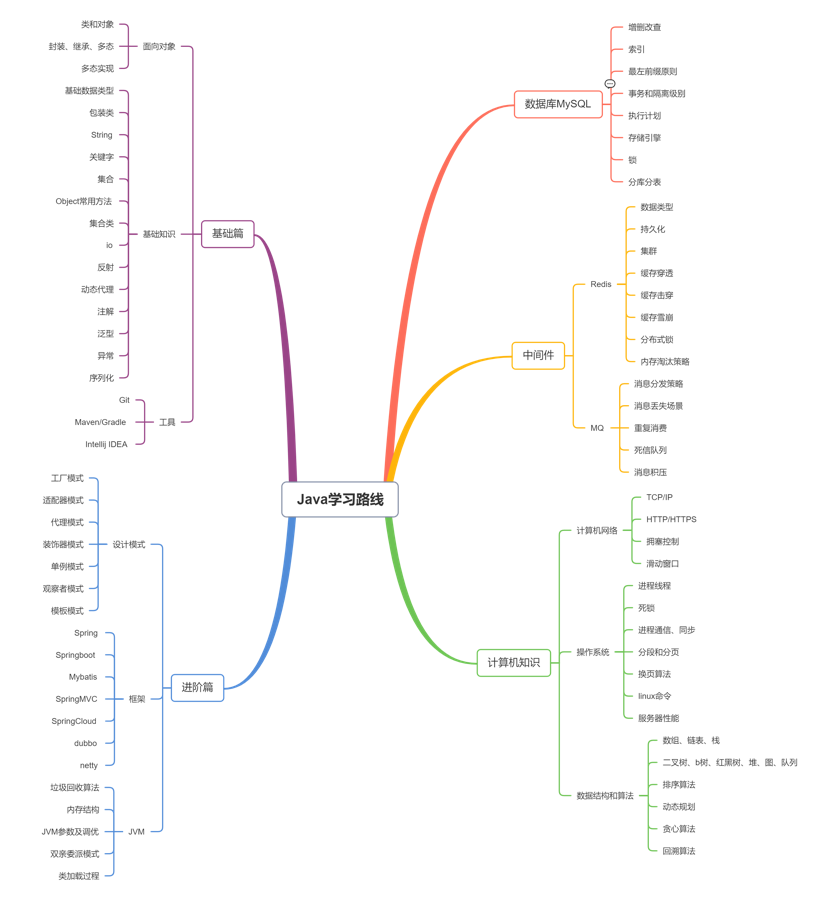

这里只列举综合性较强的站点、博客、个人主页等内容，如果只想看文章/细节的请移步到[etc](../etc/etc.md)

## 站点/系列

* [KuangStudy-Java入门教程](https://www.kuangstudy.com/course?cid=1)
* [Java教程 - 廖雪峰的官方网站 (liaoxuefeng.com)](https://www.liaoxuefeng.com/wiki/1252599548343744)
* [编程狮](https://www.w3cschool.cn/java/)
* [鱼皮 - 编程学习路线 (yupi.icu)](https://luxian.yupi.icu/#/roadmap/Java学习路线)
* [Github](github.com)
* etc(待补充)
  * (有关Java的有关站点和学习资料还是很多的，最好能有自己寻找学习资料的能力)

## 个人/团队

* [遇见狂神说_bilibili](https://space.bilibili.com/95256449)
* [黑马程序员_bilibili](https://space.bilibili.com/37974444)
* [动力节点_bilibili](https://www.bilibili.com/video/BV1Rx411876f)
* etc(待补充)

## 官方文档!!!

对于学习开发，最重要的事情是学会阅读文档。对于学习或使用一门框架，文档也是最好的老师。我们也希望在考核过程中，能够让大家培养好学习文档、编写文档、的能力。

以下列出一些常用官方文档

* [Jdk1.8 官方文档 (oracle.com)](https://docs.oracle.com/javase/8/docs/api/index.html)
* [Spring 中文文档](https://www.springcloud.cc/spring-reference.html)
* [SpringBoot 官方文档 (spring.io)](https://docs.spring.io/spring-boot/docs/current/reference/htmlsingle/)
* [SpringCloud 官方文档 (spring.io)](https://spring.io/projects/spring-cloud/)
* [Maven 官方文档 (apache.org)](https://maven.apache.org/guides/)
* [Tomcat 官方文档 (apache.org)](https://tomcat.apache.org/tomcat-8.0-doc/index.html)
* [Apache HTTP Server (apache.org)](https://httpd.apache.org/docs/)
* [Dubbo 官方文档 (apache.org)](https://cn.dubbo.apache.org/zh-cn/docs/)
* [RabbitMQ 官方文档](https://www.rabbitmq.com/documentation.html)
* [Elasticsearch 官方文档](https://www.elastic.co/guide/en/elasticsearch/reference/current/index.html)
* [Docker 官方文档](https://docs.docker.com/get-started/)
* [Kubernetes 官方文档](https://kubernetes.io/zh-cn/docs/home/)
* [Nginx 中文文档](https://blog.redis.com.cn/doc/index.html)
* [微信开发文档 (qq.com)](https://developers.weixin.qq.com/miniprogram/dev/framework/)

## 常用工具站

* [Maven中央仓库 (mvnrepository.com)](https://mvnrepository.com/)
* [Docker镜像仓库](https://hub.docker.com/)

* [在线JSON校验格式化工具 (Be JSON)](https://www.bejson.com/)
* [正则表达式在线编写校验工具 (regex101)](https://regex101.com/)
* [Json/Yaml在线转换 (fly63.com)](https://www.fly63.com/tool/jsonyaml/)
* [Unix时间戳转换 (zxgj.cn)](https://www.zxgj.cn/g/unix)

## 学习路线

